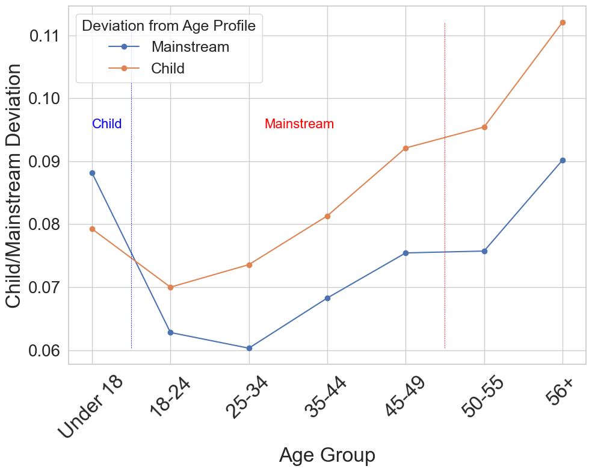
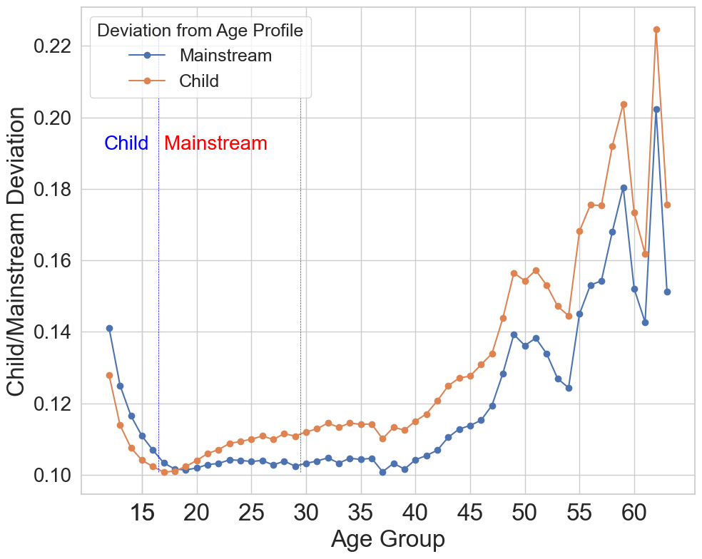
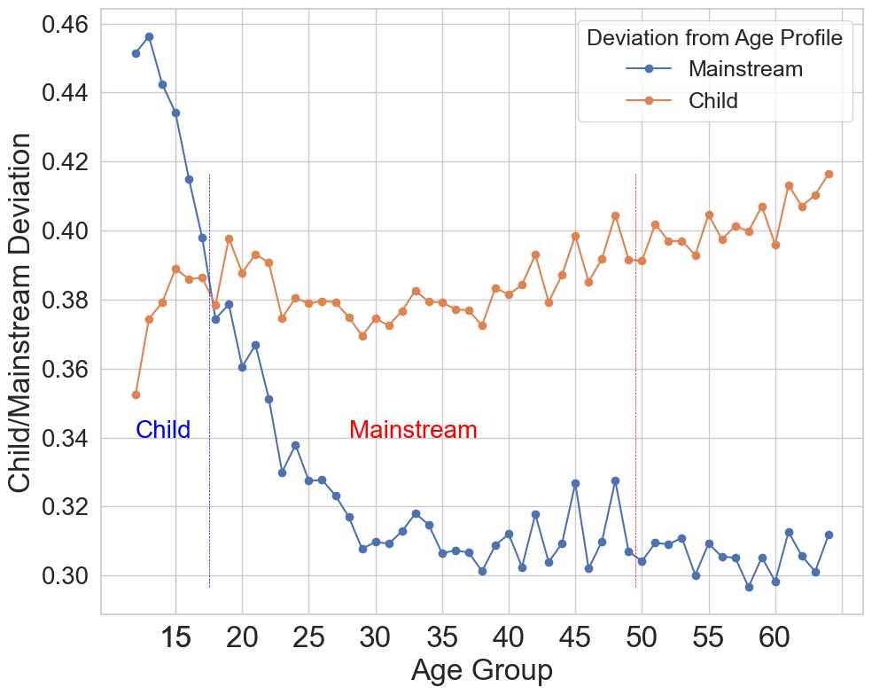

# Extended Results
Here, we provide extended results to those obtained in our reproducibility study. In particular, we present results from metrics that were excluded from the main manuscript.

## Preference Deviation Exploration

### Metric Definition

- **Mainstream Deviation** ($MD_{age}$) and **Child Deviation** ($CD_{age}$) measures the average Jensen-Shannon Divergence between $UGPs$  belonging to an age group and the $AGP_{Mainstream}$ (the average $UGP$ across all mainstream profiles) or $AGP_{Child}$ (the average $UGP$ across all child profiles)

### Results

#### ML

In line with the reference study, children's preferences align most closely to $AGP_{Child}$ and less well with $AGP_{Mainstream}$. From users belonging to the age group $18-24$ and older, user preferences align more closely with $AGP_{Mainstream}$ than with $AGP_{Child}$, and the older a user gets, the further their preferences deviate from both.

#### MLHD

On MLHD, an overall similar trend can be found than for ML. Further, the results align closely with the results obtained on LFM-2b in the reference work. Children's preferences align more closely with $AGP_{Child}$, mainstream users' and NMA's preferences align more closely with $AGP_{Mainstream}$. Interestingly, for young children, their $UGPs$ deviate on average from both $AGPs$ more markedly, and just align more closely when a child turns older. Between $16$ and $40$, deviations to both mainstream and child $AGPs$ remain quite consistent, with more deviations to the $AGP_{Child}$ the older a user gets. 

#### BX

On BX, we do not find a trend of higher deviations of young children to the child profile. Instead, the deviation of users to $AGP_{Child}$ peaks for users between $19$ and $22$, with a slow trend toward higher deviations the older a user gets. The deviation to the $AGP_{Mainstream}$ is high for young children, then drops until the age of $30$.

## RS Experiment

### Metric Definition
- **Recommendation-Mainstream Deviation** ($RMD$) and **Recommendation-Child Deviation** ($RCD$) measures the Jensen-Shannon Divergence between an $RGP$ and the $AGP_{Mainstream}$ or $AGP_{Child}$. These metrics aim to explain the degree to which recommendations align with the overall consumption trends of age groups rather than individual preferences.

### Results
|               	|             	|   	|            	| ML             	|                	| MLHD           	|                	| BX             	|                	|
|---------------	|-------------	|---	|------------	|----------------	|----------------	|----------------	|----------------	|----------------	|----------------	|
|               	|             	|   	|            	| **RCD**          	| **RMD**          	| **RCD**          	| **RMD**          	| **RCD**          	| **RMD**          	|
|               	|             	|   	|            	|                	|                	|                	|                	|                	|                	|
| $Random$        	| Child Set   	|   	| Children   	| $0.0340^*$     	| $0.0330^*$     	| $0.0243^{*}$   	| $0.0242$         	| $0.0249^*$     	| $0.0624^*$     	|
|               	|             	|   	|            	|                	|                	|                	|                	|                	|                	|
|               	| General Set 	|   	| Children   	| $0.0487$         	| $0.0387$         	| $0.0273$         	| $0.0238$         	| $0.0759$         	| $0.0228$         	|
|               	|             	|   	| Mainstream 	| $0.0468$         	| $0.0384$       	| $0.0276$         	| $0.0239$         	| $0.0748$         	| $0.0232^{n}$   	|
|               	|             	|   	| NMAs       	| $0.0462$         	| $0.0377$         	| $0.0275$         	| $0.0239$         	| $0.0749$         	| $0.0230^{m}$   	|
|               	|             	|   	|            	|                	|                	|                	|                	|                	|                	|
| $MostPop$       	| Child Set   	|   	| Children   	| $0.0223^*$     	| $0.0340^*$     	| $0.0572^{*}$   	| $0.0723^{*}$   	| $0.0555^*$     	| $0.1614^*$     	|
|               	|             	|   	|            	|                	|                	|                	|                	|                	|                	|
|               	| General Set 	|   	| Children   	| $0.0341^{m,n}$ 	| $0.0231^{m}$   	| $0.0673^{n}$    	| $0.0669^{n}$    	| $0.0993^{n}$   	| $0.0117$         	|
|               	|             	|   	| Mainstream 	| $0.0308^{c,n}$ 	| $0.0217^{c,n}$ 	| $0.0673^{n}$    	| $0.0672^{n}$    	| $0.0988^{n}$   	| $0.0118$         	|
|               	|             	|   	| NMAs       	| $0.0321^{c,m}$ 	| $0.0238^{m}$   	| $0.0689^{c,m}$ 	| $0.0689^{c,m}$ 	| $0.0978^{c,m}$ 	| $0.0113$         	|
|               	|             	|   	|            	|                	|                	|                	|                	|                	|                	|
| $RP^{3}\beta$ 	| Child Set   	|   	| Children   	| $0.0449^*$     	| $0.0553^*$     	| $0.1586^{*}$   	| $0.1685^{*}$   	| $0.0599^*$     	| $0.1201$         	|
|               	|             	|   	|            	|                	|                	|                	|                	|                	|                	|
|               	| General Set 	|   	| Children   	| $0.0921^{m}$   	| $0.0948^{m,n}$ 	| $0.1676$         	| $0.1758$         	| $0.1014^{m,n}$ 	| $0.1120^{m,n}$ 	|
|               	|             	|   	| Mainstream 	| $0.0780^{c,n}$ 	| $0.0657^{c,n}$ 	| $0.1732$         	| $0.1729$         	| $0.1507^{c,n}$ 	| $0.0875^{c}$   	|
|               	|             	|   	| NMAs       	| $0.1003^{m}$   	| $0.0790^{c,m}$ 	| $0.1784$         	| $0.1737$         	| $0.1892^{c,m}$ 	| $0.0938^{c}$   	|
|               	|             	|   	|            	|                	|                	|                	|                	|                	|                	|
| $iALS$          	| Child Set   	|   	| Children   	| $0.0537^*$     	| $0.0641^*$     	| $0.1320^{*}$   	| $0.1414^{*}$   	| $0.0687^*$     	| $0.1359^*$     	|
|               	|             	|   	|            	|                	|                	|                	|                	|                	|                	|
|               	| General Set 	|   	| Children   	| $0.0971$         	| $0.1018^{m,n}$ 	| $0.1414$         	| $0.1483$         	| $0.1005^{m,n}$ 	| $0.0890^{m,n}$ 	|
|               	|             	|   	| Mainstream 	| $0.0891^{n}$   	| $0.0783^{c,n}$ 	| $0.1451$         	| $0.1440$         	| $0.1458^{c,m}$ 	| $0.0674^{c,n}$ 	|
|               	|             	|   	| NMAs       	| $0.1072^{m}$   	| $0.0887^{m,n}$ 	| $0.1501$         	| $0.1446$         	| $0.1844^{c,m}$ 	| $0.0771^{c,m}$ 	|

Focusing on results obtained from training on the General Set, we see observe no differences on _Random_ for any user group. On all datasets, _MostPop_ leads to closer alignment with mainstream preferences. Interestingly, on MLHD, _MostPop_ leads to a similar RCD and RMD for all user groups. This may be a result from children's preferences for popular items on this dataset.  Interestingly, on ML, _MostPop_ results in the lowest RCD and RMD for Mainstream users. Thus, apparently, they receive recommendations that match "average" preferences in general. The personalized algorithms, $RP^3\beta$ and $iALS$ lead on ML and BX generally to recommendations for children that are closer aligned with overall children's preferences (low $RCD$) and for mainstream users that are closer aligned with overall mainstream users' preferences (low $RMD$). ON MLHD, no differences between users are found.

Across all RA except Random, training on the Child Set leads to a reduced $RCD$ for children while it leads to a higher $RMD$. This result shows an intuitive tendency. Since the Child Set only reflects children's interactions, the deviations to profiles captured by these are less, while no mainstream profiles are present in the Child Set, thus recommendations align less with their profiles.